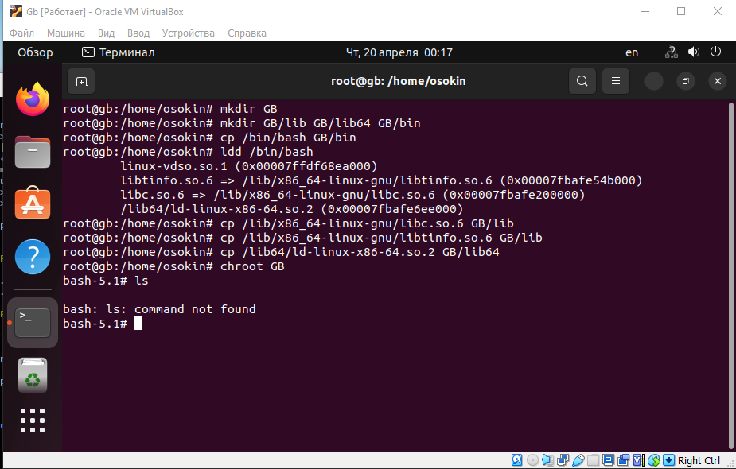

# **Контейнеризация (семинары)**
## Урок 1. Механизмы пространства имен
**Задание:** необходимо реализовать изоляцию одного и того же приложения (командного интерпретатора bash) в различных пространствах имен.

**Решение** 
1. Изоляция посредством chroot. Для этой реализации необходимо создать каталог, который будет становится корневым. Затем создать в нем каталог `bin` и скопировать туда `bash`. Для работы также необходимы связанные библиотеки, которые необходимо скопировать в каталоги `lib` и `lib64`. Перечень необходимых библиотек узнаем посредством утилиты `ldd`.

```
mkdir GB
mkdir GB/lib GB/lib64 GB/bin
cp /bin/bash GB/bin
ldd /bin/bash
cp /lib/x86_64-linux-gnu/libc.so.6 GB/lib
cp /lib/x86_64-linux-gnu/libtinfo.so.6 GB/lib
cp /lib64/ld-linux-x86-64.so.2 GB/lib64
chroot GB
```
Результат на рисунке.
