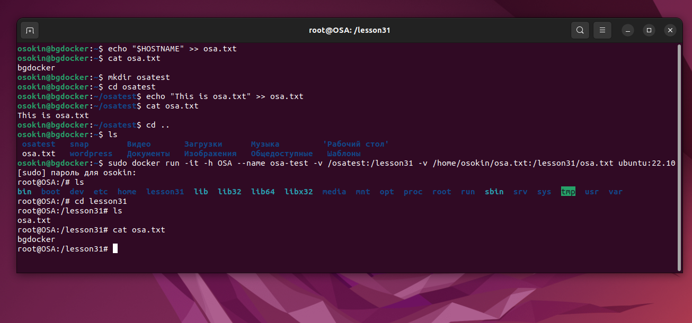
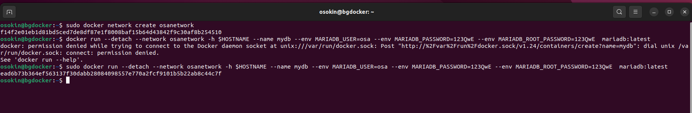
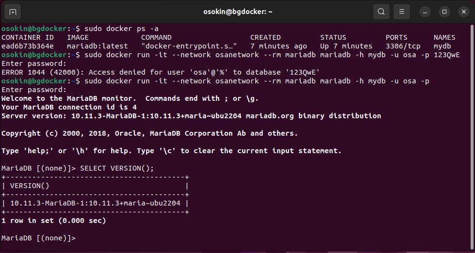

# **Контейнеризация (семинары)**
## Урок 3. Введение в Docker
**Задание:** 
- Создать папку, которую мы будем готовы смонтировать в контейнер
- В этой папке создать файл test.txt и наполнить данными
- В домашней директории создать файл test.txt, который также необходимо будет смонтировать в контейнер и наполнить совершенно другими данными
- Создать контейнер из образа ubuntu:22.10
- Задать ему имя
- Задать hostname
- Смонтировать созданную ранее папку с хоста в контейнер
- Смонтировать созданный ранее текстовый файл внутрь смонтированной папки, чтобы он пересекался с созданным ранее файлом в этой папке. Просмотреть этот файл.

**Решение:** 




**Задание:** 
- Запустить контейнер с БД, отличной(mariaDB) от mariaDB, используя инструкции на сайте: https://hub.docker.com/ 
- Добавить в контейнер hostname такой же, как hostname системы через переменную
- Заполнить БД данными через консоль 
- Запустить phpmyadmin (в контейнере) и через веб проверить, что все введенные данные доступны


**Решение:** 

***Запуск экземпляра сервера mariadb***


Создаем сеть
```
sudo docker network create osanetwork
```
Создаем котейнер 
```
sudo docker run --detach --network osanetwork -h $HOSTNAME --name mydb --env MARIADB_USER=osa --env MARIADB_PASSWORD=123QwE --env MARIADB_ROOT_PASSWORD=123QwE  mariadb:latest
```
Опции:

-- detach - после запуска остаться на хосте, а не переходить в контейнер;

-- network - использовать сеть, которую создали на первом шаге;



***Подключение к MariaDB из клиента командной строки MariaDB***

Следующая команда запускает еще один экземпляр контейнера mariadb для выполнения SQL-запросов:
```
sudo docker run -it --network osanetwork --rm mariadb mariadb -h mydb -u osa -p
```
после приглашения MariaDB вводим команду для проверки версии

```
SELECT VERSION();
```



