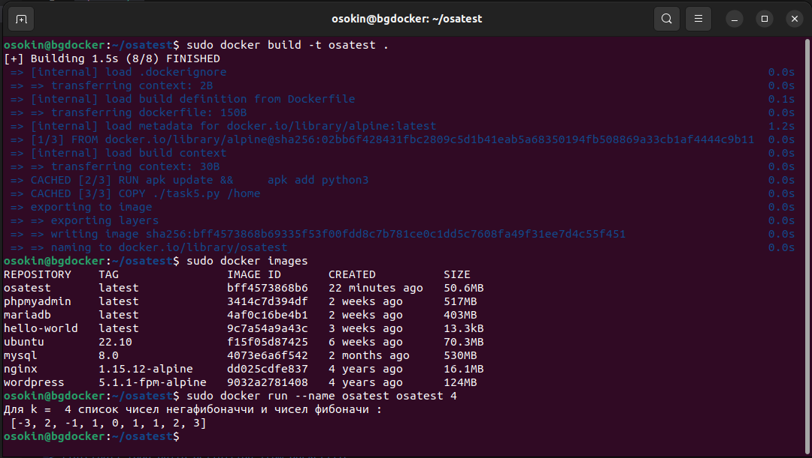

# **Контейнеризация (семинары)**
## Урок 4. Dockerfile и слои
**Задание:** необходимо создать Dockerfile, основанный на любом образе (вы в праве выбрать самостоятельно).
В него необходимо поместить приложение, написанное на любом известном вам языке программирования (Python, Java, C, С#, C++).
При запуске контейнера должно запускаться самостоятельно написанное приложение.

**Решение:** Для создания образа будем использовать Alpine. В качестве рабочего приложения программу Python для расчета чисел Негафибоначчи.

Файл Dockerfile

```
FROM alpine
RUN apk update && \
    apk add python3
COPY ./task5.py /home
ENTRYPOINT ["python3","/home/task5.py"]
```
Программа расчета числе Негафибоначчи (файл task5.py)

```
import sys

number= int(sys.argv[1])

flag=-1
out_list=[1,0,1]
for i in range(2,number+1):
    ind=len(out_list)-1
    fn=out_list[ind]+out_list[ind-1]
    out_list.append(fn)
    out_list.insert(0,fn*flag)
    flag*=-1


print(f'Для k =  {number} список чисел негафибоначчи и чисел фибоначи :\n {out_list}')
```

Результаты представлены на рисунке ниже

