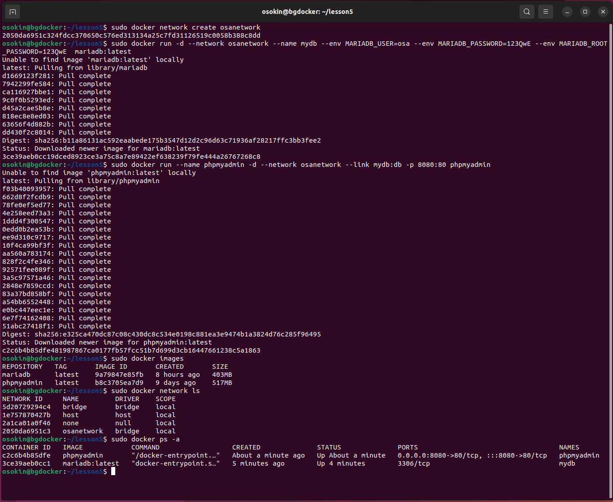
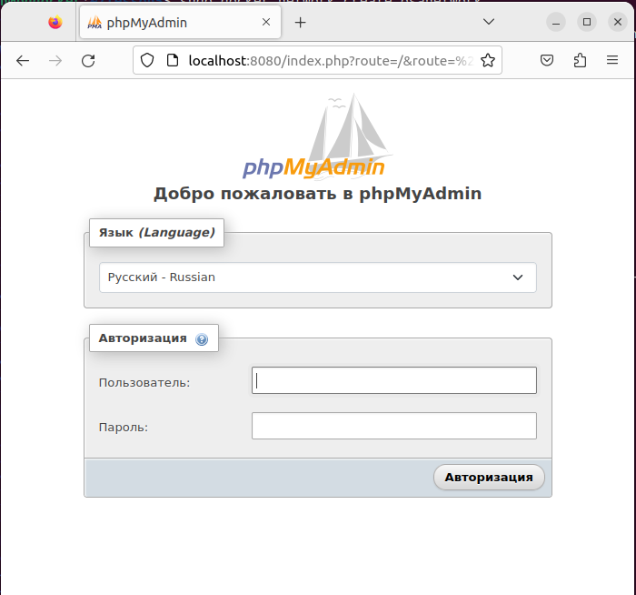
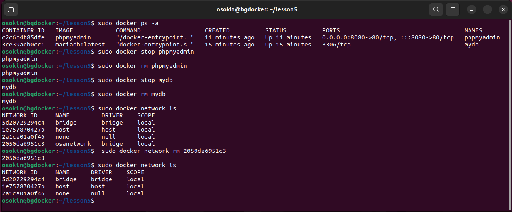
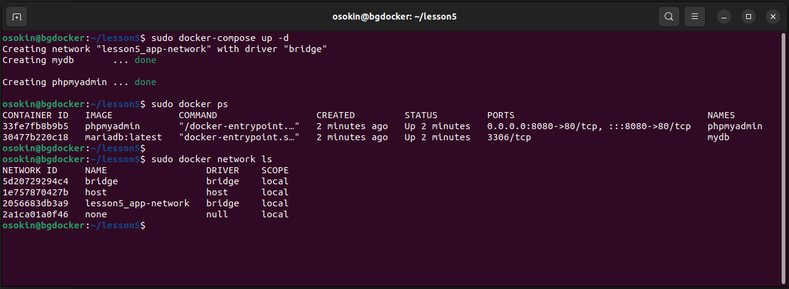
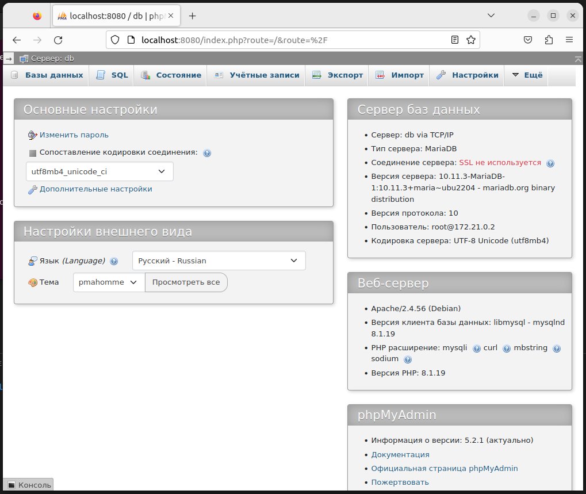

# **Контейнеризация (семинары)**

## Урок 5. Docker Compose и Docker Swarm

**Задание**

1. создать сервис, состоящий из 2 различных контейнеров: 1 - веб, 2 - БД
2. выводы зафиксировать

**Решение**

**_1. Ручное создание_**

- создаем виртуальную сеть

```
sudo docker network create osanetwork
```

- создаем контейнер с БД

```
sudo docker run -d --network osanetwork --name mydb --env MARIADB_USER=osa --env MARIADB_PASSWORD=123QwE --env MARIADB_ROOT_PASSWORD=123QwE  mariadb:latest
```

- cоздаем контейнер с phpMyAdmin

```
sudo docker run --name phpmyadmin -d --network osanetwork --link mydb:db -p 8080:80 phpmyadmin
```

- проверяем создание артефактов Docker

```
sudo docker images
sudo docker network ls
sudo docker ps
```



- проверяем работоспособность



**_2. С использованием Docker Compose_**

- для чистоты эксперемента удаляем все созданые контейнеры и сети



- создаем файл docker-compose.yml:

```
ersion: '3.9'

services:
  db:
    image: mariadb:latest
    container_name: mydb
    restart: unless-stopped
    env_file: .env
    networks:
      - app-network

  webserver:
    image: phpmyadmin
    container_name: phpmyadmin
    restart: unless-stopped
    ports:
      - "8080:80"
    networks:
      - app-network

networks:
  app-network:
    driver: bridge
```

- переменные окружения выносим в отдельный файл .env

```
MARIADB_ROOT_PASSWORD=123QwE
MARIADB_USER=osa
MARIADB_PASSWORD=123QwE
```

- 'поднимает' docker-compose и проверяем создание артефактов docker

```
sudo docker-compose up -d
sudo docker ps
sudo docker network ls
```



- проверяем работоспособность


